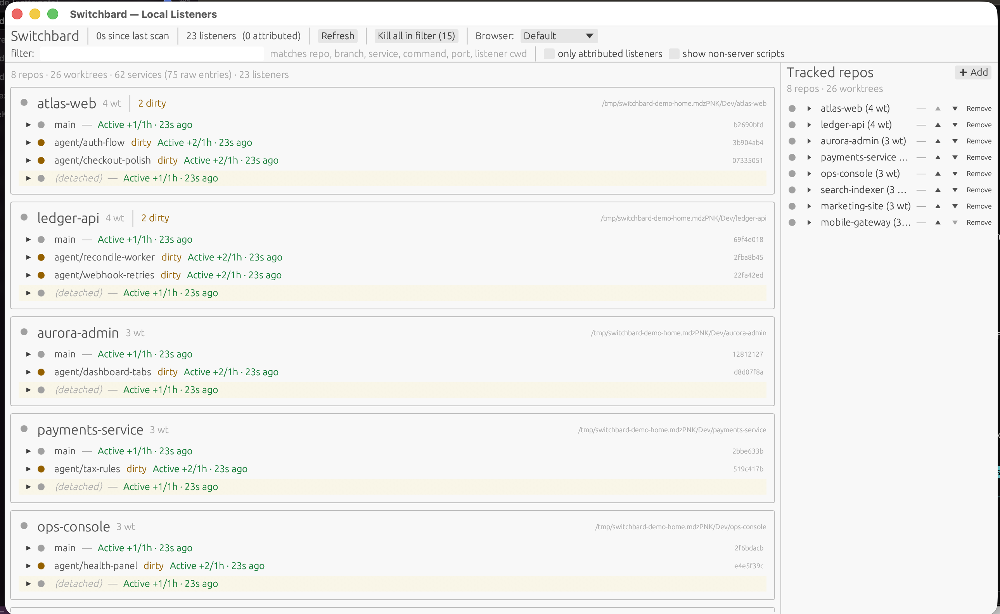

# Switchbard

Switchbard is a native desktop dashboard for developers running multiple coding
agents across git worktrees.

When Claude, Codex, or other agents are each hacking in their own worktree,
your machine quietly fills up with local servers, dirty branches, and mystery
ports. Switchbard gives you one place to see what is running, which worktree it
belongs to, and whether it is safe to open, stop, or clean up.

> **Status:** alpha. macOS has a downloadable DMG; Linux builds from source.
> The author dogfoods it daily; expect rough edges around first-run UX and
> packaging.



## Why It Exists

Agentic development makes it cheap to spin up parallel work, but expensive to
remember what each branch is doing. After a few agents, `localhost:3000`,
`localhost:5173`, and `localhost:8080` all start to blur together.

Switchbard answers the questions that usually send you spelunking through
terminal tabs:

- **What is listening on my machine right now?**
- **Which repo and worktree did this process come from?**
- **Which agent branch is dirty, active, ahead, or stale?**
- **Can I open the right service or kill the right process without guessing?**

## What It Does

- **Watches the OS for listening processes.** Scans every few seconds and
  attributes each listener back to a git worktree by walking the process's
  `cwd`.
- **Detects services from your repos' own declarations.** Reads
  `Procfile` / `Procfile.dev`, `package.json` scripts, `Makefile` targets,
  `docker-compose.yml`, and `scripts/*.sh` — surfaces what each one would
  start and what port it would bind.
- **Tracks git state per worktree.** Dirty / clean, ahead/behind from
  upstream, commit activity (Burst / Active / Slow / Idle).
- **One control surface.** Start a service, stop a process group, kill an
  external listener that's holding the port you need, open `:port` in the
  browser of your choice, or remove a worktree once you're done with it.

## Who It Is For

Switchbard is most useful if you:

- run multiple agents or humans across separate git worktrees
- keep several local dev servers alive at once
- lose time asking "what owns this port?"
- want a local-first tool with no telemetry and no cloud account

## Install

### Download The Alpha DMG

Download `Switchbard-v0.2.0-macos-arm64.dmg` from the
[latest GitHub Release](https://github.com/benpchandler/switchbard/releases/latest),
open it, then drag `Switchbard.app` to `Applications`.

Switchbard is currently unnotarized and does not use Developer ID signing. The first
time you launch it, open it from Finder with Control-click -> `Open`, then confirm
macOS's unidentified developer prompt. If you see "`Switchbard` Not Opened" with
only `Move to Trash` / `Done`, click `Done` and use Control-click -> `Open`. See
[docs/INSTALL-MAC.md](docs/INSTALL-MAC.md) for the full install and
verification notes.

### Linux From Source

Linux support currently ships as a source build, not a packaged `.deb` /
`.AppImage` yet.

On Ubuntu/Debian, install the usual Rust GUI build/runtime packages:

```sh
sudo apt-get install git build-essential pkg-config libxkbcommon-dev \
  libwayland-dev libx11-dev libxcb1-dev libxcb-render0-dev \
  libxcb-shape0-dev libxcb-xfixes0-dev libgl1-mesa-dev \
  xdg-utils xdg-desktop-portal
```

Then build and run:

```sh
git clone https://github.com/benpchandler/switchbard
cd switchbard
cargo build --release -p switchbard-gui
./target/release/switchbard
```

Switchbard scans Linux listeners via `/proc`, so it does not need `lsof` on
Linux. `xdg-open` is used for opening ports in your default browser. See
[docs/INSTALL-LINUX.md](docs/INSTALL-LINUX.md) for distro package notes.

### macOS From Source

Requires Rust `1.95.0` with `rustfmt` and `clippy`. Any toolchain that
matches works — `rustup default 1.95.0` if you don't have it.

```sh
git clone https://github.com/benpchandler/switchbard
cd switchbard
cargo build --release -p switchbard-gui
bash scripts/bundle-mac.sh        # produces target/release/Switchbard.app
open target/release/Switchbard.app
```

To package the same DMG that ships on the Releases page:

```sh
bash scripts/package-dmg.sh       # produces target/dist/Switchbard-v0.1.1-macos-arm64.dmg
```

Or, if you just want the `switchbard` binary on your `PATH`:

```sh
cargo install --git https://github.com/benpchandler/switchbard --bin switchbard
switchbard
```

**Optional — pinned toolchain via [mise](https://mise.jdx.dev/).** Mise is
not required; it's just how CI and the maintainer pin the exact Rust version.
If you'd rather not manage that yourself, install mise and run
`mise install` in the checkout — `mise.toml` pins `1.95.0` and exposes the
same builds as `mise run bundle` / `mise run package`, plus
`mise run build` for the plain release binary and `mise run hooks:install` to
opt into the tracked pre-push hook.

A Homebrew tap is on the roadmap.

## First run

The app starts with no repos configured. Click **➕ Add** in the right
sidebar and pick a folder containing a git repository — Switchbard enumerates its
worktrees and starts probing. Repeat for every repo you care about.

Configuration lives at `~/.switchbard/config.toml` (TOML, hand-editable). Logs of
services Switchbard started land in `$TMPDIR/switchbard-logs/`.

## How it's built

Two-crate Cargo workspace:

- **`switchbard-core`** — domain logic. No UI deps. Owns the listener scanner,
  service detectors, git probes, classifier, port-conflict logic, and the
  `ResolvedService` cluster model. Heavily unit-tested.
- **`switchbard-gui`** — the [egui](https://github.com/emilk/egui) /
  [eframe](https://github.com/emilk/egui/tree/master/crates/eframe) app.
  Single window, no webview, native binary.

Worker threads handle long-running probes (`lsof` on macOS, `/proc` on Linux,
`git status`, `git log`) so the UI never blocks. The scanner kicks every 3s;
the GUI re-renders only when state changes.

## Building from source

Plain Cargo, on any Rust `1.95.0` toolchain:

```sh
cargo fmt --all -- --check
RUSTFLAGS="-D warnings" cargo clippy --workspace --all-targets -- -D warnings
RUSTFLAGS="-D warnings" cargo test --workspace --all-targets
cargo build --release                # optimized binary
bash scripts/bundle-mac.sh           # macOS: produces Switchbard.app
bash scripts/package-dmg.sh          # macOS: produces the DMG
```

If you'd rather have the toolchain pinned for you, install
[mise](https://mise.jdx.dev/) and the same commands are exposed as
`mise run fmt`, `mise run clippy`, `mise run test`, `mise run ci`,
`mise run build`, `mise run bundle`, and `mise run package`. CI runs the mise
tasks for version consistency; the tracked pre-push hook (opt in with
`mise run hooks:install`) runs `mise run ci` before each push.

## Contributing

PRs welcome. Keep changes scoped, run the local checks before pushing, and
include a one-line "why" in the commit body. The codebase favors small
modules and explicit names — read the current source for ground truth.

## License

MIT. See [LICENSE](LICENSE).
